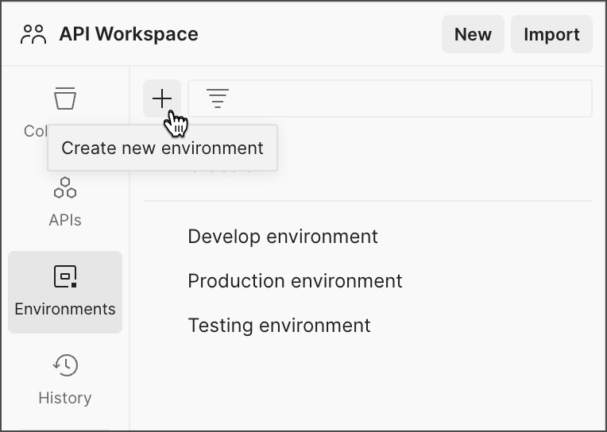
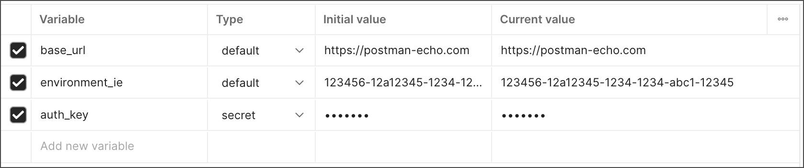
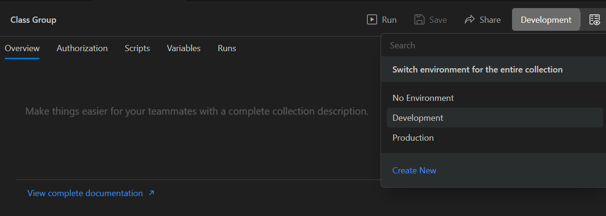
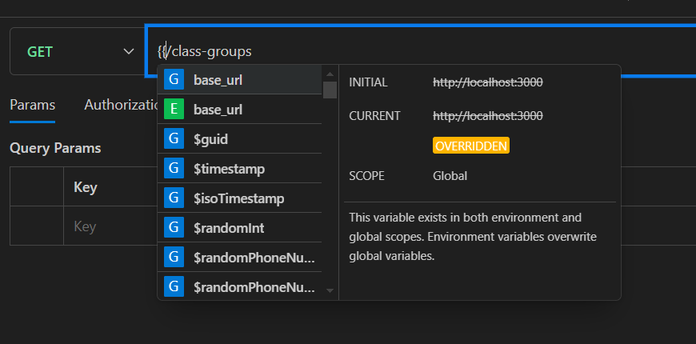
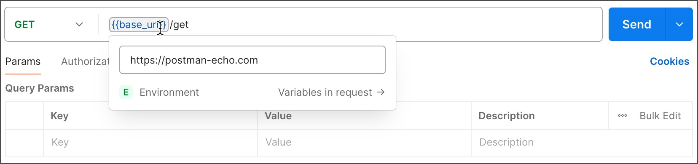
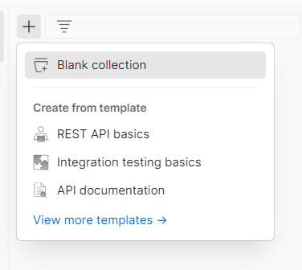
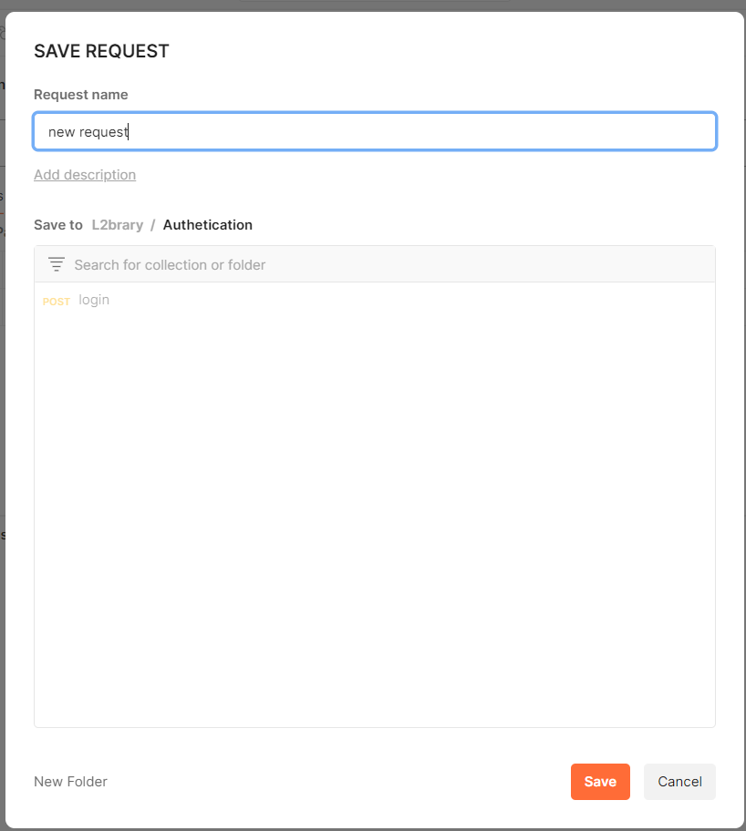

# POSTMAN

Postman là một công cụ kiểm thử API phổ biến, giúp các nhà phát triển dễ dàng gửi yêu cầu HTTP, kiểm tra phản hồi và tự động hóa quy trình kiểm thử API. Nó hỗ trợ nhiều phương thức HTTP như `GET`, `POST`, `PUT`, `DELETE`,... cho phép gửi dữ liệu dưới dạng JSON, XML, form-data, và cung cấp các tính năng mạnh mẽ như:

- **Quản lý môi trường:** Dùng biến môi trường để dễ dàng chuyển đổi giữa các cấu hình.
- **Tạo bộ sưu tập (Collections)**: Giúp tổ chức và chia sẻ các yêu cầu API.
- **Kiểm thử tự động**: Viết script kiểm thử bằng JavaScript để xác minh phản hồi API.
- **Mock Server**: Tạo API giả lập để thử nghiệm mà không cần backend thực.
- **Tích hợp CI/CD**: Hỗ trợ chạy kiểm thử API trong pipeline DevOps.

## Quản lý môi trường

Quản lý môi trường trong Postman giúp bạn dễ dàng chuyển đổi giữa các cấu hình API mà không cần chỉnh sửa từng request

1. Trong sidebar, nhấn biểu tưởng "Environment", chọn + để thêm môi trường mới.

1. Nhập tên cho môi trường mới

1. Thêm các biến môi trường.

1. Nhấn `💾 Lưu` hoặc Ctrl + S

**Type** "default" hoặc "secret": giá trị sẽ xuất hiện nếu chọn "default" sẽ sẽ bị giấu đi như mật khẩu nếu chọn "secret"

**Initial value**

- Là giá trị mặc định của biến môi trường.
- Được lưu trữ và đồng bộ khi chia sẻ môi trường với đồng đội.
- Nếu bạn xuất file môi trường (.json), chỉ Initial Value được lưu lại.
- Khi bạn reset biến môi trường, nó sẽ quay về Initial Value.

**Current Value**

- Là giá trị tạm thời trong phiên làm việc hiện tại.
- Không được đồng bộ khi chia sẻ môi trường với người khác.
- Nếu bạn thay đổi giá trị này, nó chỉ ảnh hưởng đến phiên làm việc của bạn.
- Khi đóng Postman, giá trị này có thể bị mất nếu không lưu vào Initial Value.

**Sử dụng biến môi trường**

Trong các colections, Ta có thể chọn môi trường để chạy API của mình

 

Để sử dụng biến từ môi trường đã chọn, bạn chỉ cần đặt tên biến trong 2 ngoặc nhọn `{{var_name}}`

## Tạo Collection

1. nhấn + trên thanh sidebar trong mục Collections

1. Chọn template mong muốn hoặc tạo colllection trống

1. Nếu chọn "Blank Collection", mục Collection sẽ hiện lên. Nhập tên collection để đổi tên

1. Chọn New > [giao thức của Request]

1. Nhập URL, params, các thông tin cần thiết và nhấn lưu

1. Hộp thoại yêu cầu tên request và nơi lưu, sau khi điền, bạn có thể nhấn "Save"

## Kiểm thử tự động

Trong Postman, script là các đoạn mã JavaScript được sử dụng để tự động hóa kiểm thử API, xử lý dữ liệu, và thực hiện các thao tác trước hoặc sau khi gửi yêu cầu. Có hai loại script chính:

1. Pre-request Script
- Chạy trước khi gửi request.
- Dùng để thiết lập biến môi trường, tạo token xác thực, hoặc xử lý dữ liệu đầu vào.

2. Post-request Script
- Chạy sau khi nhận phản hồi từ API.
- Dùng để kiểm tra mã trạng thái, nội dung phản hồi, thời gian phản hồi, v.v.

